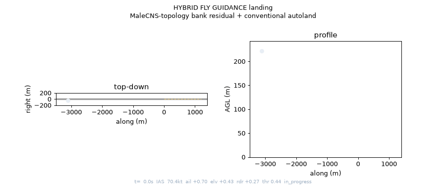
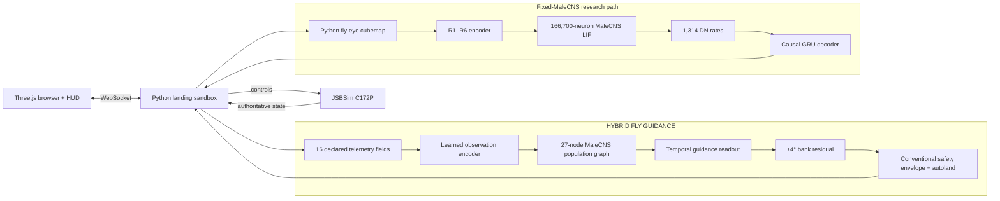

# FlyPilot

**A real-time connectome and flight-control research platform built around a JSBSim Cessna 172P.**

FlyPilot combines aircraft physics, a browser simulator, the public MaleCNS
fruit-fly connectome, neural simulation, imitation learning, closed-loop
evaluation, and reproducible model artifacts. Its working controller uses a
task-trained MaleCNS-topology graph policy as a safety-bounded guidance residual
inside a conventional autoland hierarchy.

**Final held-out result: 100/100 valid autonomous landings.**



> This is a connectome-constrained **hybrid controller**, not a claim that a
> biological fly brain naturally knows how to fly a Cessna. The learned graph
> contributes bounded bank guidance; conventional control handles the safety
> envelope, glideslope, airspeed, flare, and actuator stabilization.

## Results

All landing results use randomized position, altitude, airspeed, heading,
flight-path angle, angle of attack, and roll within the documented
`DECODER_SPAWN` envelope.

| Controller | Runtime inputs and authority | Closed-loop result |
|---|---|---:|
| `ExpertLandingController` | Conventional cascaded autoland baseline | **100/100** |
| **HYBRID FLY GUIDANCE** | Safety-bounded learned graph residual + conventional autoland | **20/20 validation, 100/100 final test** |

Final hybrid test, seeds `7000–7099`:

| Metric | Result |
|---|---:|
| Valid landings | **100/100** |
| Crashes / failed approaches | **0 / 0** |
| Mean absolute centerline error | **4.31 m** |
| Mean touchdown sink rate | **493 fpm** |
| Mean absolute heading error | **0.93°** |

Exact episode reports, controller ablations, and the stricter DN-only research
path are retained under [`artifacts/`](artifacts/) and [`docs/`](docs/).

## Architecture



JSBSim is the only aircraft physics integrator. The browser renders the state it
receives and never dead-reckons a second aircraft. Neural and vision clocks are
driven by simulation time rather than browser frame rate.

## What is measured, modeled, learned, and conventional?

| Layer | Provenance |
|---|---|
| MaleCNS neuron identities and 25,582,938 directed connections | **Measured** connectome data |
| Transmitter-derived signs, population aggregation, fly-eye optics, and LIF dynamics | **Modeled** engineering assumptions |
| Observation encoder, graph message passing, temporal readout | **Learned** from expert guidance demonstrations |
| Bank safety envelope, glideslope, airspeed, flare, and rate stabilization | **Conventional** aircraft control |
| C172P dynamics | **Simulated** by JSBSim |

The 27-node policy graph is built by aggregating every prepared MaleCNS edge by
annotated superclass while retaining connection direction and presynaptic sign.
The checkpoint embeds and hashes this graph, so inference does not require the
1.1 GB source dataset.

## Modes

| HUD mode | What controls the aircraft? |
|---|---|
| **MANUAL** | Keyboard and HUD inceptors |
| **EXPERT** | Conventional cascaded PID autoland |
| **EXPERT + FLY OBSERVING** | Expert flies; fly-eye → MaleCNS runs causally but has no authority |
| **FLY CONTROL** | Frozen MaleCNS DN activity feeds the experimental temporal decoder |
| **HYBRID FLY GUIDANCE** | Learned MaleCNS-topology residual inside the conventional autoland hierarchy |

Mode switches are atomic. Missing datasets or checkpoints disable the relevant
button and produce an actionable HUD error without dropping the WebSocket.

## Quickstart

Requirements: Python 3.11+, Node.js/npm, and a platform supported by the
`jsbsim` Python package.

```bash
git clone https://github.com/harshb16/fly-pilot.git
cd fly-pilot
bash scripts/install.sh
bash scripts/start.sh
```

Open [http://127.0.0.1:5173](http://127.0.0.1:5173), choose **HYBRID FLY
GUIDANCE**, then press **Resume**. New browser sessions intentionally start
paused so the uncommanded C172 cannot diverge before a mode is selected.

The committed hybrid checkpoint works immediately. Full MaleCNS observing and
DN-only FLY CONTROL additionally require approximately **1.1 GB** of source
data:

```bash
source .venv/bin/activate
python -m fly_pilot.brain.prepare
```

Preparation is idempotent and validates the official files by SHA-256. Raw
connectome files and all training Parquet data remain uncommitted.

## Verification

```bash
# Backend tests + complete frontend production build
bash scripts/test.sh

# Portable checkpoint checks; no training data required
source .venv/bin/activate
python -m fly_pilot.verify_graph_artifact
python -m fly_pilot.verify_artifact

# Reproduce the committed hybrid evaluation
python -m fly_pilot.evaluate_graph \
  --checkpoint artifacts/connectome_graph/best.pt \
  --episodes 100 --seed 7000 \
  --json artifacts/connectome_graph/final-eval.json
```

The graph verifier checks the checkpoint hash, embedded topology hash,
population ordering, metadata, observation ordering, deterministic reset, and
an inference smoke test. The DN verifier additionally checks descending-neuron
body-ID order.

## Training workflow

```bash
# Collect 100 successful wide-spawn demonstrations at 20 Hz
python -m fly_pilot.record_expert \
  --episodes 100 --seed 5000 --stride 6 --wide-spawns \
  --output data/graph/expert_guidance.parquet

# Train the population-graph policy
python -m fly_pilot.train_graph_policy \
  --data data/graph/expert_guidance.parquet \
  --output artifacts/connectome_graph/best.pt
```

The checkpoint records its source commit, dirty-tree state, dataset SHA-256,
split, seed, architecture, graph hash, training parameters, and metrics.

The stricter DN-only workflow also supports shadow-expert DAgger collection and
multi-dataset episode-isolated training:

```bash
python -m fly_pilot.record_dagger --checkpoint artifacts/decoder/best.pt \
  --episodes 25 --seed 1100 --output data/decoder/dagger-round-1.parquet

python -m fly_pilot.train_decoder \
  --data data/decoder/expert_dn_controls.parquet \
  --data data/decoder/dagger-round-1.parquet \
  --output artifacts/decoder/best.pt
```

## Repository map

```text
backend/fly_pilot/
  aircraft.py                 JSBSim C172P integration
  sandbox.py                  clocks, controller authority, episode loop
  controllers/graph.py        deployed hybrid residual controller
  brain/graph_policy.py       MaleCNS population graph and learned policy
  controllers/trained.py      fixed-MaleCNS DN-only controller
  train_graph_policy.py       episode-isolated guidance training
  record_dagger.py            fly-controlled states + shadow expert labels
  evaluate_graph.py           hybrid closed-loop evaluation and demo
frontend/                     Vite + Three.js simulator and provenance HUD
tests/                        JSBSim integration, neural, protocol, artifact tests
artifacts/                    committed checkpoints and evaluation reports
docs/                         design, methodology, and research review
```

## Research notes

- [Hybrid controller design and ablations](docs/hybrid-guidance.md)
- [Primary-source fly-brain implementation review](docs/research-implementation-review.md)
- [Fixed-MaleCNS decoder experiment](docs/decoder.md)
- [MaleCNS preparation and modeling assumptions](docs/malecns.md)
- [Fly-eye renderer and sensory pathway](docs/vision.md)

The next research milestone is to replace the hybrid policy's telemetry input
with calibrated retinotopic visual features while keeping the conventional
aircraft stabilizer. That would support the stronger claim that a
connectome-constrained visual system supplies the landing guidance.
